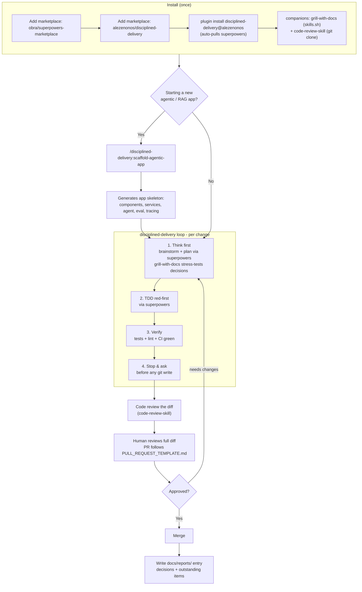

# disciplined-delivery

[](https://github.com/alezenonos/disciplined-delivery/actions/workflows/ci.yml)

A Claude Code plugin with two skills:

- **`disciplined-delivery`** — ship work as small, test-first, individually reviewable
  increments, with the human as the gate that commits and merges.
- **`scaffold-agentic-app`** — one-shot scaffolder for a production RAG/agentic LLM app
  (Python + FastAPI) with light placeholder code.

## How it works

Install once, then let the skills drive the workflow: scaffold a new agentic/RAG app if you
need a starting structure, then ship every change through the disciplined-delivery loop —
plan/test via `superpowers`, keep CI green, run `code-review-skill` over the diff, hand it to
a human, and leave a `docs/reports/` entry.



## Install

> **Pointing an AI agent (Claude Code) at this repo?** Tell it: *"Install the skills
> from this repo following the README."* The commands below, run in order, install
> everything: this plugin's two skills, the `superpowers` dependency, and the companion
> skills (`grill-with-docs` and `code-review-skill`).

### Quick install (one shot)

From a checkout of this repo:

```bash
./install.sh
```

It adds both marketplaces, installs the plugin (which auto-pulls `superpowers`), and prints
the remaining companion-skill steps.

### Manual install

Run inside Claude Code (slash commands) **or** in a terminal (prefix each with `claude `):

```bash
# 1. Add obra's marketplace FIRST — a dependency from a marketplace you have not
#    added is left unresolved.
/plugin marketplace add obra/superpowers-marketplace

# 2. Add this marketplace and install the plugin. This auto-resolves and installs
#    `superpowers` (cross-marketplace install is permitted by
#    allowCrossMarketplaceDependenciesOn in this repo's marketplace.json).
/plugin marketplace add alezenonos/disciplined-delivery
/plugin install disciplined-delivery@alezenonos

# 3. Install the grill-with-docs companion skill. It ships via skills.sh (not a Claude
#    Code plugin), so it is a separate step:
npx skills@latest add mattpocock/skills   # then select grill-with-docs

# 4. Install the code-review-skill companion (a bare skill, installed by git clone):
git clone https://github.com/awesome-skills/code-review-skill.git ~/.claude/skills/code-review-skill
```

Terminal equivalents: `claude plugin marketplace add …` and `claude plugin install …`.

### What gets installed

| Component | Source | How |
| --- | --- | --- |
| `disciplined-delivery` skill | this repo | plugin install |
| `scaffold-agentic-app` skill | this repo | plugin install |
| `superpowers` (brainstorming, writing-plans, TDD, verification) | obra/superpowers-marketplace | auto-resolved dependency |
| `grill-with-docs` | mattpocock/skills (`skills.sh`) | `npx skills@latest add` |
| `code-review-skill` | awesome-skills (GitHub) | `git clone` into `~/.claude/skills/` |

### Verify your install

Confirm it actually works after installing:

```bash
# Plugin + its dependency are installed and enabled
claude plugin list                       # disciplined-delivery@alezenonos + superpowers, both enabled

# Companion skills are present
ls ~/.claude/skills/code-review-skill    # code-review-skill cloned
npx skills@latest list                   # lists grill-with-docs

# The bundled generator runs end to end
claude plugin validate .                 # if developing from a checkout
```

In a Claude Code session, `/disciplined-delivery:disciplined-delivery` and
`/disciplined-delivery:scaffold-agentic-app` should both autocomplete. If `superpowers` shows
as unresolved, you skipped adding obra's marketplace first (see step 1).

## Skills

Once installed, the skills are namespaced by the plugin:

- `/disciplined-delivery:disciplined-delivery`
- `/disciplined-delivery:scaffold-agentic-app`

Claude also loads them automatically when a task matches their description.

## Layout

```
CLAUDE.md             # project memory + working principles (after Karpathy)
README.md  LICENSE  CONTRIBUTING.md  CHANGELOG.md  install.sh
pyproject.toml        # ruff + pytest config
.claude-plugin/
  plugin.json         # plugin manifest + dependencies
  marketplace.json    # marketplace catalog (self-hosts this plugin)
.github/
  workflows/ci.yml    # CI (Python 3.10-3.13 matrix; SHA-pinned actions)
  dependabot.yml      # keeps the pinned actions current
  PULL_REQUEST_TEMPLATE.md
docs/
  reports/            # one task report per change (_TEMPLATE.md + dated reports)
scripts/
  validate_manifests.py
skills/
  disciplined-delivery/SKILL.md
  scaffold-agentic-app/SKILL.md  scaffold.py  references/structure.md
tests/                # unit tests for the generator + validator
```

## Contributing

Anyone contributing — human or agent — follows the same rules; this repo dogfoods its own
skill. See [`CONTRIBUTING.md`](CONTRIBUTING.md).

## Development

CI (`.github/workflows/ci.yml`) runs on every push and PR. Reproduce it locally:

```bash
# 1. Lint and unit-test this repo's own tooling
pip install ruff pytest
ruff check .
pytest -q

# 2. Validate plugin/marketplace manifests and skill frontmatter
python scripts/validate_manifests.py

# 3. Authoritative manifest check (requires the Claude Code CLI)
claude plugin validate .

# 4. Scaffold generator self-test: generate, compile, prove idempotency, test
python skills/scaffold-agentic-app/scaffold.py /tmp/app
python -m compileall -q /tmp/app
python skills/scaffold-agentic-app/scaffold.py /tmp/app   # re-run: created: 0 file(s)
( cd /tmp/app && pip install -r requirements.txt && pytest -q )
```

A change is not done until CI is green on the branch.
